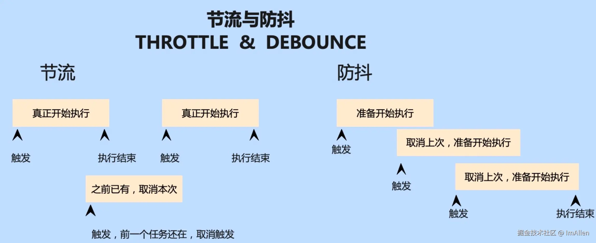

### Fragment

- http 请求：

​	cookie：每次都会携带在 HTTP 头中，如果使用 cookie 保存过多数据会带来性能问题

​	localStorage 和 sessionStorage：仅在客户端（即浏览器）中保存，不参与和服务器的通信

**Cookie 通常需要封装使用的主要原因之一是 Cookie 的内容本质上是一个字符串**，而 localStorage 和 sessionStorage 本身是以键值对的形式操作数据的，这使得它们的原生 API 更直观和易用

**Cookie**：

- 需要在客户端和服务器之间共享小型数据（如会话 ID）。

- 需要设置安全属性（如 HttpOnly 和 Secure）来保护数据。

| 属性           | 作用                                                 | 使用场景                                | 适用性                                                       | 设置方式                                           |
| -------------- | ---------------------------------------------------- | --------------------------------------- | ------------------------------------------------------------ | -------------------------------------------------- |
| **`Secure`**   | 仅在 HTTPS 协议下发送 Cookie，确保数据的传输是加密的 | 防止在不安全的 HTTP 连接下泄露敏感信息  | 仅在 HTTPS 连接下有效                                        | `document.cookie = "name=value; Secure;"`          |
| **`HttpOnly`** | 防止 JavaScript 访问 Cookie，增强对 XSS 攻击的防护   | 防止恶意脚本访问敏感信息，如 Session ID | 禁止 JavaScript 访问 Cookie                                  | `document.cookie = "name=value; HttpOnly;"`        |
| **`SameSite`** | 限制 Cookie 的跨站点发送，防止 CSRF 攻击             | 防止 Cookie 在跨站请求中被泄露          | `Strict`（严格）: 完全阻止；`Lax`（宽松）: 只对危险请求有效；`None`（无）: 允许跨站点请求发送 Cookie | `document.cookie = "name=value; SameSite=Strict;"` |


token存在cookie比较好，因为可以设置secure httponly防止xss攻击。后端用setcookie配置token，由于cookie跨域不共享，还需要在前端设置withcreditiral（不会拼了）为true。后端设置cors的origin不能为*️⃣ 

offsetWidth**、**offsetHeight **获取元素的可见尺寸**，clientWidth**、**clientHeight **不包括边框**，而 scrollWidth**、**scrollHeight **包括滚动内容**。


### 前端性能优化的方案：

资源缓存cache

- CDN（Content Delivery Network，内容分发网络）是一种加速网站加载的技术，将静态资源（CSS、JS、图片等）存储在**全球多个数据中心**，让用户从最近的服务器获取资源。

- 启用浏览器缓存，配置 Cache-Control 头部，允许浏览器缓存静态资源

  | **场景**                         | **Cache-Control 头部**                               | **适用资源**                             |
  | -------------------------------- | ---------------------------------------------------- | ---------------------------------------- |
  | **长期缓存（静态资源）**         | `Cache-Control: public, max-age=31536000, immutable` | CSS、JS、图片                            |
  | **短时间缓存（可能变更的资源）** | `Cache-Control: private, max-age=3600`               | HTML 页面                                |
  | **完全不缓存**                   | `Cache-Control: no-store`                            | API 响应、敏感数据                       |
  | **强制重新验证 ETag**            | `Cache-Control: must-revalidate`                     | 需要服务器确认资源是否变化，否则重新下载 |

- **使用 Service Worker 进行缓存**

网络优化

-  **启用 HTTP/2 或 HTTP/3**：支持多路复用（Multiplexing），减少请求阻塞问题，加快资源加载。

- **DNS 预解析（Preconnect & Prefetch）**：预解析域名，提高外部资源的加载速度。

  ```html
  <link rel="preconnect" href="https://cdn.example.com" />
  <link rel="dns-prefetch" href="https://cdn.example.com" />
  ```

- 资源预加载:如字体、图片、脚本等。

```html
<link rel="preload" href="styles.css" as="style" />
<link rel="preload" href="script.js" as="script" />
```


- SSR

- SSG（静态生成）：预生成 HTML 页面，减少服务器压力，提高访问速度。**？？？**

- 减少重绘repaint和回流reflow

  **回流（Reflow）** 又称为 **重排**，是指当页面的元素**几何属性（大小、位置等）发生变化**时，浏览器需要重新计算布局，更新页面结构，触发整个或部分页面的重新渲染。

  **重绘（Repaint）** 是指元素的**视觉属性**（如颜色、背景、阴影等）发生变化时，浏览器不需要重新计算布局，只需要重新绘制元素即可。

  推荐方式：

  1. **用** transform **代替** top/left，transform: translate() 不会触发回流，比 position: absolute; top: 10px; 更高效。因为 transform **仅影响绘制，不影响文档流**
  2. **使用 visibility: hidden 代替 display: none**，display: none 会触发**回流 + 重绘**，而 visibility: hidden 只会触发**重绘**

- 使用Web Worker

  主要用于 **后台线程** 执行 **复杂计算任务**，如数据处理、图像处理、大规模计算等，目的是将耗时的任务移到主线程之外，以 **避免主线程阻塞**，保证页面的 **流畅性和响应性**。

  示例场景：进行复杂的数据计算时，保持界面交互不卡顿，或进行大文件处理时，避免 UI 被阻塞。

  原理：在浏览器中，Web Worker 通过创建一个独立的线程来处理后台任务。主线程通过 postMessage() 发送数据给 Worker，Worker 处理完任务后，通过 postMessage() 将结果发送回主线程。它 **不阻塞 UI 渲染**，因此非常适合执行复杂的计算或长期运行的任务。

  ```js
  // main.js
  // 创建一个 Web Worker
  const worker = new Worker('worker.js');
  
  // 向 Worker 发送数据
  worker.postMessage({ num1: 10, num2: 20 });
  
  // 监听 Worker 返回的消息
  worker.onmessage = function(e) {
    console.log('Worker 返回的结果:', e.data);  // 输出：30
  };
  
  // 监听 Worker 错误
  worker.onerror = function(error) {
    console.error('Worker 错误:', error.message);
  };
  ```

  ```js
  // worker.js
  // 监听主线程发送的消息
  self.onmessage = function(e) {
    const { num1, num2 } = e.data;
    const sum = num1 + num2;
  
    // 将计算结果发送回主线程
    self.postMessage(sum);
  };
  ```

  

- **CSS Sprites（雪碧图）**通过将多个小图标或 UI 组件合并到**一张大图**中，然后使用 background-position 来显示其中的某个部分。这样可以减少 HTTP 请求次数，提高页面加载速度。


### 前端性能监控

前端监控系统大体可以分为四部分

- 异常监控
- 用户数据监控
- 性能监控
- 异常报警

#### 性能监控

> 性能监控是一种用于追踪和评估网站和性能的方法。它专注于用户在浏览器中与网站互时的性能体验

- **首次绘制（FP）**： 全称 First Paint，标记浏览器渲染任何在视觉上不同于导航前屏幕内容之内容的时间点
- **首次内容绘制（FCP**）：全称 First Contentful Paint，标记的是浏览器渲染来自 DOM 第一位内容的时间点，该内容可能是文本、图像、SVG 甚至 `<canvas>` 元素。
- **首次有效绘制（FMP）**：全称 First Meaningful Paint，标记的是页面主要内容绘制的时间点，例如视频应用的视频组件、天气应用的天气信息、新闻应用中的新闻条目。
- **最大内容绘制（LCP）**：全称 Largest Contentful Paint，标记在可视区“内容”最大的可见元素开始绘制在屏幕上的时间点。
- 白屏时间
- http 等请求的响应时间
- 静态资源整体下载时间
- 页面渲染时间
- 页面交互动画完成时间


##### 节流throttle && 防抖 debounce



```js
// 防抖
export function debounce(fn, delay = 300, immediate = false) {
  let timer = null;

  return function (...args) {
    const context = this;
    if (immediate && !timer) {
      fn.apply(context, args); // 立即执行
    }
    clearTimeout(timer);
    timer = setTimeout(() => {
      fn.apply(context, args);
    }, delay);
  };
}
```

```js
// 节流
export function throttle(fn, delay = 300, leading = true, trailing = true) {
  let lastCall = 0;
  let timer = null;

  return function (...args) {
    const context = this;
    const now = Date.now();

    if (!lastCall && !leading) lastCall = now;

    const remainingTime = delay - (now - lastCall);

    if (remainingTime <= 0) {
      if (timer) {
        clearTimeout(timer);
        timer = null;
      }
      lastCall = now;
      fn.apply(context, args);
    } else if (!timer && trailing) {
      timer = setTimeout(() => {
        lastCall = leading ? Date.now() : 0;
        timer = null;
        fn.apply(context, args);
      }, remainingTime);
    }
  };
}
```

**微前端（Micro Frontends）&&  微服务（Microservices）** 

微前端是一种前端架构思想，它将一个大型前端应用拆分为多个 **独立的小型前端应用**（微应用），这些微应用可以 **独立开发、独立部署、独立运行**，最终在同一个主应用中集成，形成一个完整的前端系统。


本质上，webpack 是一个现代 JavaScript 应用程序的静态模块打包器(module bundler)

**Webpack 出现时（2012年）还没有 ESM 规范，而 Vite 出现时（2020年）现代浏览器已经支持 ES Modules（ESM），所以 Vite 能直接利用浏览器原生的 ESM 机制** 来实现模块化加载，而不需要像 Webpack 那样先打包整个项目

Webpack 通过**解析模块依赖**（import、require()），然后**打包成一个 bundle.js**，让浏览器可以执行整个应用程序

**Vite虽然开发时不打包，但生产环境仍然要打包**，以优化性能：

- **减少 HTTP 请求**（将多个模块合并）。

- **Tree Shaking**（去掉未使用代码）。

- **代码压缩**（减小文件体积）。


页面首次加载速度（First Contentful Paint，FCP）


打包时既然可以把多模块打包减少HTTP请求，为什么不能把图片资源等一起打包

**📌 如果把图片资源全部打包：**

- 生成的 **bundle.js 体积会变得很大**，导致浏览器**下载时间变长**，影响页面首次加载速度（First Contentful Paint，FCP）。

- 用户可能只访问页面的一部分，但仍然需要加载所有打包的图片，造成 **不必要的流量消耗**。

**📌 让图片单独请求的优势：**

- **浏览器可以并行加载多个图片文件**，避免 JS 解析和执行阻塞页面渲染。

- **按需加载**（Lazy Load）：图片可以**在用户滚动到时再加载**，而不是一次性加载所有图片，提高首屏加载速度。
- 图片可以利用浏览器的cache存储

**📌 如果图片单独请求**

**可以根据设备类型加载不同的图片格式**，比如：

- 移动端加载 600px **小图**

- PC 端加载 1080px **高清图**

- 现代浏览器支持 WebP，旧浏览器使用 JPEG 或 PNG

- srcset 方案：让浏览器自动选择合适的图片版本

```html

```

📌 **支持渐进式加载 & 占位符**

- 页面打开时，**可以先显示低质量的占位图**，然后加载高清图：

  ```html
  
  ```


**高内聚低耦合**

高内聚意味着模块内部的组件紧密相关，专注于完成某一特定功能；低耦合则表示模块之间相互依赖较少，改变一个模块不会对其他模块造成太大影响。这样的结构有利于系统的扩展和维护。


@media 

```css
@media (条件) {
  /* CSS 规则 */
}
```

响应式布局(responsitive design)

1、fluid grid layouts流式布局：使用百分比或 em 作为单位，而不是固定像素（px）

2、弹性布局**Flexible Images**：根据父组件的大小展示

```css
img {
  max-width: 100%;
  height: auto;
}
```

3、media query 为不同屏幕尺寸定义不同的样式

响应式设计注意优先移动端(media first)

```css
/* 默认小屏样式 */
body {
  font-size: 14px;
}

/* 大屏样式 */
@media (min-width: 900px) {
  body {
    font-size: 16px;
  }
}
```

CI/CD 持续集成（Continuous Integration）、持续交付（Continuous Delivery）、或持续部署（Continuous Deployment）

开发者提交代码到 Git 仓库 ---> CI 工具（如 Jenkins、GitHub Actions、GitLab CI）触发构建 ---> 自动运行测试，生成构建结果

**持续交付**：部署是“可选”的。

**持续部署**：部署是“自动”的。


### Babel工作流程

1. 解析（Parsing）:在编译的第一阶段，Babel 使用 `@babel/parser` 将源代码解析成抽象语法树（AST）。
2. 转换（Transforming）:一旦生成了 AST，接下来就是对其进行遍历和修改。这一步骤由 `@babel/traverse` 完成，它可以提供深度遍历 AST 节点的能力，并允许通过插件来实现具体的转换逻辑。插件可以定义 visitor 函数，在进入或离开特定类型的节点时执行自定义的操作，比如添加、删除或替换节点
3. 生成（Generating）：经过转换后的 AST 需要被重新序列化为 JavaScript 代码。这是由 `@babel/generator` 负责完成的任务，它会遍历新的 AST 并打印出目标代码字符串，同时还可以生成 source map 文件，以便于调试

**Babel 本身并不会对代码做任何转换；所有的转换都是通过插件来实现的**。

Babel 引入了 preset 的概念，它是多个相关插件的集合，旨在一次性解决一组相关的转换需求。例如，`@babel/preset-env` 可以根据指定的目标环境自动选择所需的转换规则，减少了手动配置的工作量


### CSS工具链

在Web开发中，CSS代码压缩和剪枝是优化网站性能的重要步骤。通过移除不必要的字符、注释以及未使用的样式规则，可以显著减少CSS文件的大小，从而加快页面加载速度。


#### CSS代码压缩

##### CssNano

`CssNano` 是一个基于PostCSS的CSS优化工具，它能够在保持CSS代码语义不变的情况下，执行一系列优化操作，如删除多余的**空白符及注释、简化选择器**等，以确保最终生成的CSS文件尽可能小

##### optimize-css-assets-webpack-plugin

对于使用Webpack构建系统的项目而言，`optimize-css-assets-webpack-plugin` 插件是一个不错的选择。该插件可以在生产模式下自动压缩CSS文件，并且兼容其他类型的资源优化插件。安装后，只需将其添加到Webpack配置中的`optimization.minimizer`数组即可启用压缩功能。

##### css-minimizer-webpack-plugin

随着Webpack 5的到来，推荐使用`css-minimizer-webpack-plugin`来替代旧版本中的`optimize-css-assets-webpack-plugin`**进行CSS压缩**


#### CSS代码剪枝

##### PurifyCSS

`PurifyCSS` 是一款专门用来清除未使用CSS代码的工具。它可以分析HTML文档并与之关联的CSS文件对比，识别出哪些样式规则实际上并未被应用，进而将这些冗余部分从最终输出中剔除。

##### UnCSS

`UnCSS`也是一个能够检测并移除网页中未引用CSS规则的工具。不过，`UnCSS`更加注重对动态内容的支持，例如JavaScript生成的DOM元素或AJAX加载的内容。这意味着即使是在复杂的交互式页面上，也能有效去除无用样式。


**一般webpack中CSS压缩和CSS剪枝结合使用**


#### PostCSS

PostCSS是一个 **基于 JavaScript 的 CSS 处理工具**，它本身并不是 CSS 预处理器（如 Sass、Less），而是一个 **插件平台**，允许你使用各种插件对 CSS 进行**转换、优化和增强**

PostCSS 在现代前端构建工具（如 Webpack、Vite、Rollup）中广泛使用，并可用于 **自动添加前缀、优化 CSS、支持未来 CSS 语法、移除无用 CSS 代码** 等。

可以单独安装 PostCSS，也可以集成到 Webpack、Vite 或 Gulp 中。

##### 功能示例

**Autoprefixer**：这是一个非常受欢迎的 PostCSS 插件，用于自动为 CSS 属性添加必要的浏览器前缀。它基于 Can I Use 数据库确定哪些前缀是必需的，并根据配置的目标浏览器范围进行相应的调整

**PreCSS**：此插件集成了多个有用的功能，包括但不限于变量、嵌套、继承等 Sass 类似特性。它让那些习惯于预处理器语法的人能够在不改变原有工作流的情况下快速上手 PostCSS

**Stylelint**：作为一种先进的 Linter 工具，Stylelint 可以帮助开发者发现潜在的问题，比如拼写错误、冗余选择器或是不符合团队约定俗成的格式化问题。这对于维持高质量的代码库至关重要

**配置方案一**

```js
// 在配置文件postcss.config.js中配置autoprefixer插件
module.exports = {
  plugins: [
    require('autoprefixer')({
      // 兼容市面上所有版本浏览器
      browsers: ['> 0%']
    })
  ]
};
```

**配置方案二**

```json
// 在package.json里配置
{
  "postcss": {
    "plugins": {
      "autoprefixer": {},
      "cssnano": {}
    }
  }
}
```


postcss-preset-env 是一个 **PostCSS 插件集合**，它的主要作用是 **让你可以使用最新的 CSS 语法，而不用担心浏览器兼容性**。它会 **将现代 CSS 语法转换为当前浏览器支持的 CSS**。

你可以把它当作 **Babel 的 CSS 版本**，它让你可以提前使用未来的 CSS 特性，而不必手动编写兼容性代码。


#### CSS原子化概念

CSS原子化（Atomic CSS）是一种**CSS架构方式**，它提倡**将样式拆分为最小且独立的单位**——即“原子”。**每个原子类只包含一个或少数几个特定的样式属性**，如颜色、边距、字体大小等。

##### Tailwind

```html
<button class="bg-blue-500 text-white px-4 py-2 rounded">Click me</button>
```

在这个例子里：

bg-blue-500 只控制背景颜色	text-white 只控制文字颜色	px-4 只控制水平内边距	py-2 只控制垂直内边距	rounded 只控制圆角


### 构建工具和脚手架

#### 构建工具 (将开发者编写的源代码转换成浏览器能够理解和执行的形式)

#### 脚手架 (提供界面交互和基础工程模板)

##### Create React App (CRA)

Create React App 是官方推荐的 React 应用创建工具，它为开发者提供了一个无需配置的环境来快速搭建 React 项目。CRA 内置了对 Babel、ESLint 和 Webpack 的支持，使得开发者可以专注于业务逻辑而非繁琐的工具链设置。

##### Vue Cli

Vue CLI 是 Vue.js 官方提供的命令行工具，用于生成完整的项目结构并集成常用的构建工具和库。它不仅简化了项目的初始设置，还提供了灵活的插件系统，允许开发者轻松扩展功能。

##### Next.js

Next.js 是一个React框架，它不仅仅是一个简单的脚手架工具，而是提供了完整的解决方案，包括服务器端渲染（SSR）、静态站点生成（SSG）、API路由等功能。Next.js 的特点是易于上手且功能强大，适合构建从简单博客到复杂电子商务平台等各种类型的Web应用。


### 用户鉴权机制原理

#### session-cookie

Session就是一个信息，并且有一个唯一标识，来识别身份

将服务器保存信息，生成一个唯一标识，然后下发给客户端，保存在cookie中，这样每次客户端就能使用这个唯一标识去判断用户的一些状态以及登录信息，这就是session-cookie的原理。

#### hash算法

Hash（哈希）算法 是一种将 任意长度输入映射为固定长度输出 的函数，广泛应用于 数据加密、数字签名、数据完整性校验、数据库索引、密码存储 等场景。

#### token

一个 JWT token 是一个字符串，它由三部分组成，令牌头、载荷（payload）与签名（Signature）


### Web Worker 性能优化

**Web Worker** 是 HTML5 提供的一种 API，允许在 **主线程（Main Thread）之外** 创建**独立的 JavaScript 线程**，用于执行 **耗时操作（如计算、数据处理、文件解析）**，从而避免主线程阻塞，提高 Web 应用的性能和响应速度。

- 与主线程并行运行，不会阻塞 UI 渲染。
- 通过 postMessage 和 onmessage 进行数据传递。
- 不能直接操作 DOM，也无法访问 window、document 等对象。
- 适用于大数据计算、文件解析、复杂循环运算等。

当主线程使用`worker.postMessage`发送消息时，工作线程中的`message`事件处理函数就会被触发。当工作线程使用`worker.postMessage`发送消息时，主线程中的`message`事件处理函数就会被触发。所以就是用来通信的。

postMessage是一种**异步通信**

**主线程**

```javascript
    function startCalculation() {
      // 创建一个Web Worker对象，指定worker.js作为工作线程的脚本
      const worker = new Worker('worker.js');
      worker.postMessage(10000000); // 发送数据给 Worker

      worker.onmessage = function (event) {
        console.log("计算结果:", event.data); // 接收 Worker 计算后的结果
      };

      // 主线程关闭 Worker 的方法（可选）
      worker.terminate();
    }
```

**工作线程**

```js
// worker.js
// self是对工作线程自身全局对象的引用。类似于浏览器主线程中的window对象，要注意的self不能访问 DOM 相关内容
self.onmessage = function (event) {
  const num = event.data;
  let result = 0;
  for (let i = 0; i < num; i++) {
    result += i;
  }
  // 将结果发送回主线程
  self.postMessage(result);
  // 工作线程关闭worker的方法
  self.colse();
};
```


